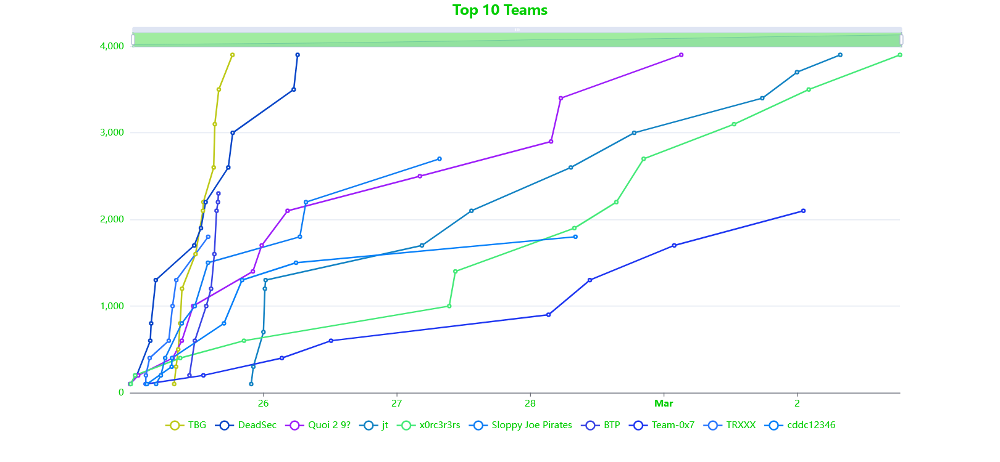

# Trellix HAX 2023 CTF

Final results, solutions, and source code for Trellix HAX 2023, the latest annual Capture The Flag (CTF) competition hosted by Trellix Advanced Research Center.

Ran from February 25th, 12:00 a.m. PST through March 11th, 12:00 a.m. PST.

Check out the backstory [here](story.md)!

## Winners
|     Place    |     Team         |     Captain           |     Other Members    |     Allegiance    |
|--------------|------------------|-----------------------|----------------------|-------------------|
|     1st      |     TBG          |     TheBadGod         |                      |     East          |
|     2nd      |     DeadSec      |     DeadSec           |                      |     East          |
|     3rd      |     Quoi 2 9?    |     movrment          |                      |     East          |
|     4th      |     jt           |     jt                |                      |     West          |
|     5th      |     x0rc3r3rs    |     green-panda999    |     r3tZy, annexe    |     East          |

You can see the find the final scoreboard [here](./final-scoreboard.md).

## Challenges

The competition featured **12** challenges across **3** categories, totalling **3900** points.

### Exploitation
**400 Points**
- [Reachable Fruit](exploitation/reachable-fruit/)
- [Free Yo Radicals - Part ii](exploitation/free-yo-radicals-part-ii/)

**500 Points**
- [Free Yo Radicals - Part iii](exploitation/free-yo-radicals-part-iii/)

### Reverse Engineering
**100 Points**
- [Spying through the webdoor](reverse_engineering/spying-through-the-webdoor/)

**200 Points**
- [Free Yo Radicals - Part i](reverse_engineering/free-yo-radicals-part-i/)
- [Symbolic Victory](reverse_engineering/symbolic_victory/)

**300 Points**
- [Rusty Snek](reverse_engineering/rusty-snek/)

**400 Points**
- [A Micro What?](reverse_engineering/a_micro_what/)
- [The Governor's Secret](reverse_engineering/the_governor_secret/)
- [Classic Game Theory](reverse_engineering/classic-game-theory/)

**500 Points**
- [Stacks on Stacks](reverse_engineering/stacks-on-stacks/)

### Web
**100 Points**
- [We Need to Break Free](web/we_need_to_break_free/)

## Analytics
- **1467** registered players.
- **955** registered teams.
- "We Need to Break Free" had the most solves at **255**.
- "A Micro What?" and "Reachable Fruit" had the least solves at **6**.
- **5** teams achieved the maximum possible score of 3900.

