# Solution Write Up for 'Free Yo Radicals Part ii'
# Expected Behavior
The provided [server_binary](challenge/server_binary) listens on port `9999` for traffic. Since this challenge is incremental from the "Free Yo Radicals Part i" the propriatary protocol of "creating", "deleting", "printing", and "exiting" should be already known.


```bash
# Start the Server
./server_binary
```

# Solution

1. First step is to identify the flaw in the code. Luckily the symbols are still included. In the main function after a user connects will fork the process and run "zechallenge" #1

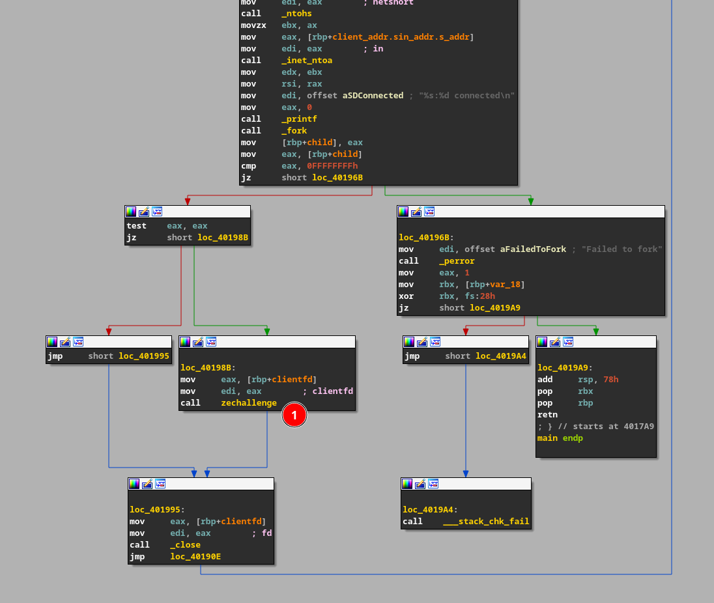
**Figure:** The main function with a call to "zechallenge".

2. In the "zechallenge" function it is clear to see all of the 4 actions being handled here. Since these functions are often used for heap corruption issues the first place to look is how creating and deleting are done.
3. Within the create function the first thing it does is check that there aren't more than 5 entries (#1). Next it will check for any termination charater in the coordinate field ONLY (#2), if a termination charater is found in the coordinate field it will skip the mallocing of a new coordinate entry and continue (#3).

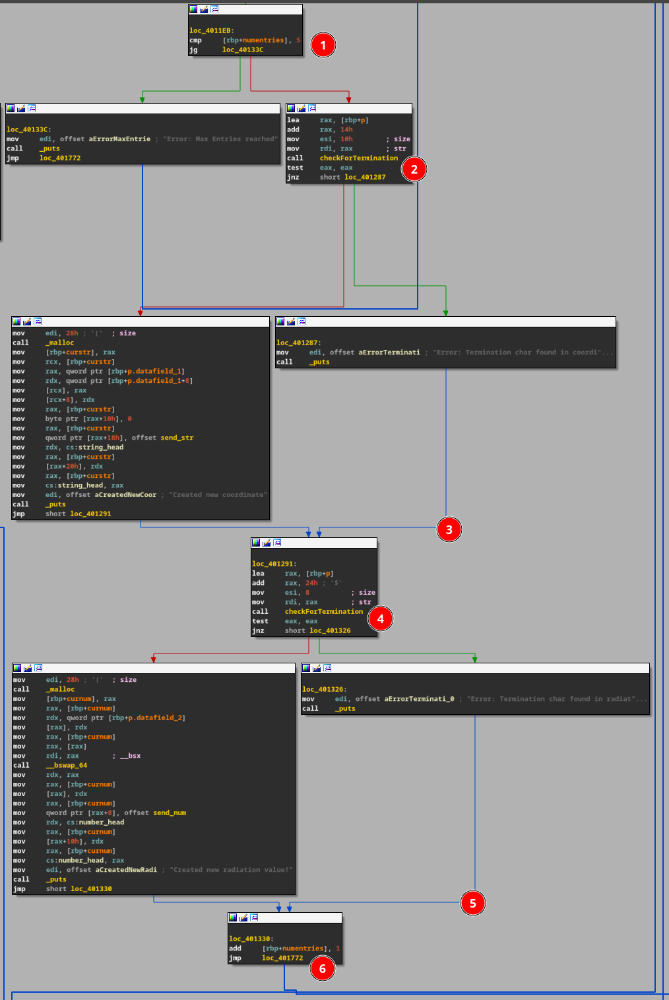

**Figure:** Disassembly view of the "create" action.

The first issue is that it then checks for the termination value in the "radiation" value (#4) Instead of just exiting the function and eventually continues (#5) just like in the coordinate logic. The second issue is that it still increments the "numentries" field (#6).

These issues allow for a packet to be created with a termination value placed inside of either a coordinate or radition value and have it skip the creation of said value. 

4. The exploitable nature of thes data structs originate from the fact that both the "coordinate" and "radiation" struct include a pointer to a print function. 

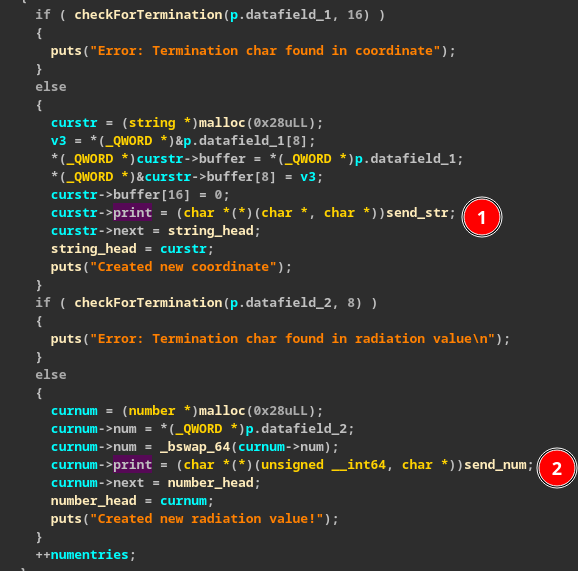
**Figure:** Both data structs include pointers to their "send" function.

Now it can be identified using the knowledge gained that this binary is vulnerable to a use after free (UAF). Next step is to identify how that function pointer is being called.

5. Looking at the "print" action to see how the "send" functions included in the data structs are called we can see that for each entry they call the included pointer from the data struct.

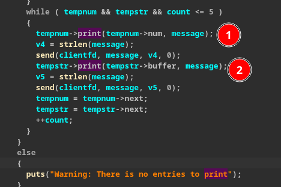

**Figure:** The print action calls the included pointer to the respective "send" functions.

Now that we have identified a way to write / delete data and confuse the system and know of a way to redirect code execution if we can overwrite the "send" function included in the struct we should beabel to exploit the UAF.

6. To attempt to use a freed value we will first send a packet with a coordinate value of `0x0c` (Termination character) and a radiation value of `1337` (0x539). As a result only the radation struct is malloced and looks like the following.
 
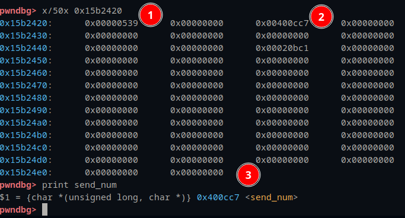

**Figure:** Heap memory of the radiation value created.

The #1 is our value `1337` and #2 is the "send_num" function as seen in #3. This is the value we want to over write and then "call" the "send_num" function which will actually be a pointer of our choosing. 

7. Next we will have to free the struct we just created. This can be done by calling the "delete" action and giving it the value of `1337`.

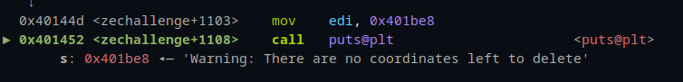

**Figure:** Since we never created a "coordinate" value there are none to delete

Next we will actually free the memory location of the radiation value `1337` as seen below with the heap address (#1).

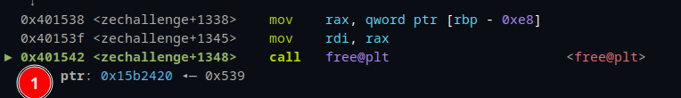

**Figure:** Freeing the heap loation of our radiation value `1337`.

8. Now that we have a freed memory loaction on the heap we want to overwrite the "send_num" function pointer with the pointer to "print_flag". To do this the next packet to send will only create a coordinate and adding a terminator value for the radation level. Since the coordinate and the radiation value structs are the same size the new coordinate value will malloc the same address that we just freed. 

** Please note that during this write up multiple sessions were used, meaning that the heap address most significate bits are changed. However the least significant bits are the same across multiple runs. **

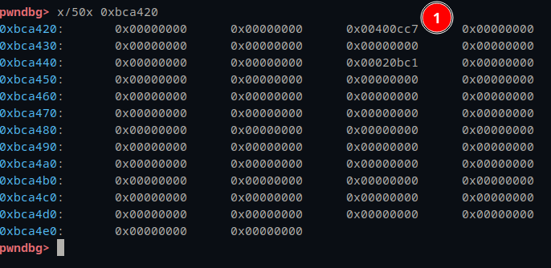

**Figure:** The `1337` value has been deleted but the address to the "send_num" function (#1) is still present in the freed memory location.

Sending the coordinate value of `AAAABBBBCCCCDDDD` one can see below that where the previous "send_num" function was located it will now include the value of `0x4444444443434343` (#1), but also include the address of the "send_str" function pointer 16 bytes later (#2 and #3).

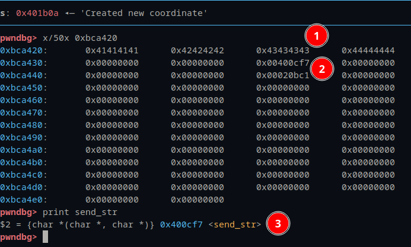

**Figure:** Memory contents after overwriting the "send_num" function with `0x4444444443434343`.

9. Now the last step is to call print and have it print the "radiation value" that we actually deleted in doing so will call our new pointer of `0x4444444443434343`. But before we dive into that we must first understand the logic in the print action. 

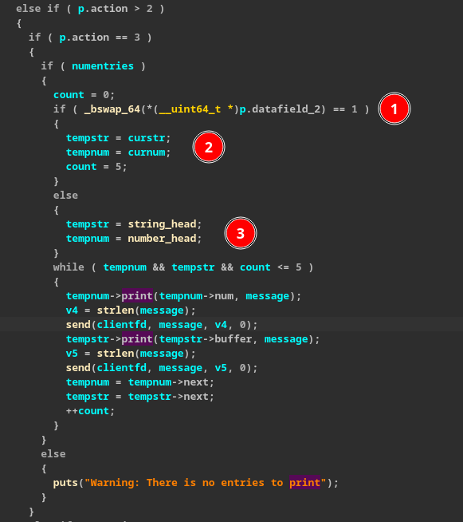

**Figure:** Locic in the print action

While calling print a value can be passed either `0` or `1`, `0` seems to print all of the values in the linked list starting at the head and a value of `1` seems to only print the last item. Lets start off with a value of `0` first and see what the results are.

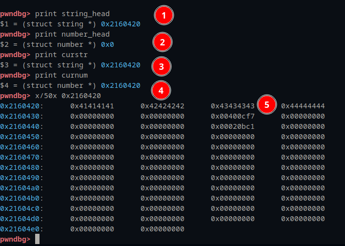

**Figure:** GDB printing out the values of the two different options.

As seen above the two different paths dictated by either the `0` or `1` contain different values. "string_head" is correct since we never "deleted" that value. But "number_head" is pointing to `0x00` which will cause the print function to think there is a problem and not print anything. But if a `1` is passed in it uses the "curstr" and "curnum" values which for the coordinate value is corret, and the radation value that we "freed" is also still in there meaning that if we pass a `1` to the print function we should execute our `0x4444444443434343` overwritten value as seen below (#1).

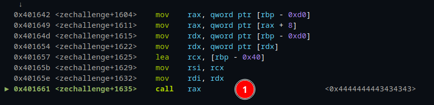

**Figure:** Call to RAX that we control.

10. Now that we have code execution we need to find the address of the "print_flag" function.

```
[*] '/projects/CTF/2023_ctf/Free_Yo_Radicals_Part_ii/challenge/server_binary'
    Arch:     amd64-64-little
    RELRO:    No RELRO
    Stack:    Canary found
    NX:       NX enabled
    PIE:      No PIE (0x400000)
```
Running "checksec" on the binary it looks like it is not RELRO and NO PIE so the address should be the same on our machine and the live server. The address in IDA should be the address on the running system too.

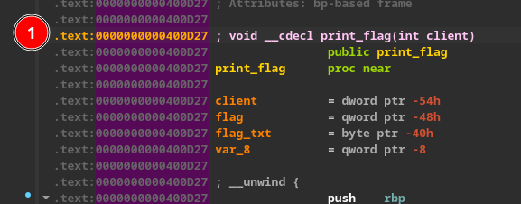

**Figure:** Address of print_flag

11. Now we just need to replace `0x4444444443434343` with the "print_flag" address of `0x400d27`.

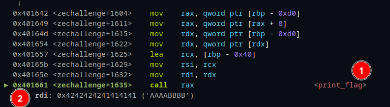

**Figure:** Call to "print_flag"

The call to "print_flag" is correct and we actually control the arguments passed to the function too. To investigate what those arguments are used for we can take a look at the "print_flag" function for answers.

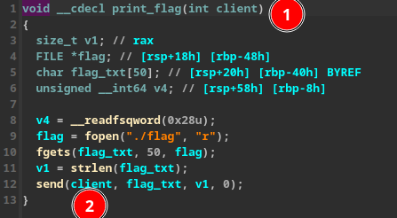

**Figure:** "print_flag" arguments.

It looks like the argument passed to "print_flag" is the file descriptor of the socket comunication. Running it locally and with only one client connected it defaults to `0x4` so lets pass that in (#1).

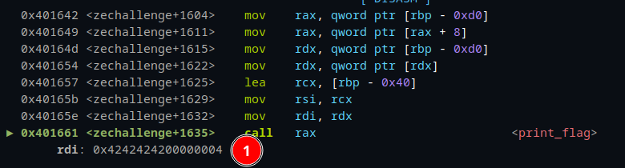

**Figure:** `0x04` passed as the cliend file descriptor.

With that looking good if we continue into the function, and after it reads in the "flag.txt" file. It calls send as seen below with all the correct arguments (#1).

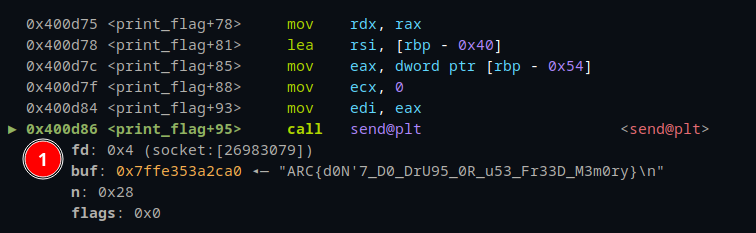

**Figure:** All the correct arguments to the "send" function.

Now with that send all we need to do is keep listening on our current socket and the flag will appear.

## Supporting solution info
Propriatary protocol scapy layer: [proto_util.py](solution/proto_util.py)

Python PWNTools Script: [level01.py](solution/level01.py)

### Usage: ```python3 ./level01.py```

### Expected output:

```
[*] '/projects/CTF/2023_ctf/Free_Yo_Radicals_Part_ii/challenge/server_binary'
    Arch:     amd64-64-little
    RELRO:    No RELRO
    Stack:    Canary found
    NX:       NX enabled
    PIE:      No PIE (0x400000)
[+] Opening connection to localhost on port 9999: Done
[+] Connected
[+] Address of print_flag: 0x400d27
[+] Sending create
[+] Sending delete
[+] Sending create
[+] Sending print
[+] Flag: ARC{d0N'7_D0_DrU95_0R_u53_Fr33D_M3m0ry}
[*] Closed connection to localhost port 9999
```

[//]: <> (Give an explination of the code and how to run it here. Make sure to explain the correct output so that anyone following allong can verify that it is running correctly.)


# Flag
[//]: <> (Add the flag below)
**ARC{d0N'7_D0_DrU95_0R_u53_Fr33D_M3m0ry}**
