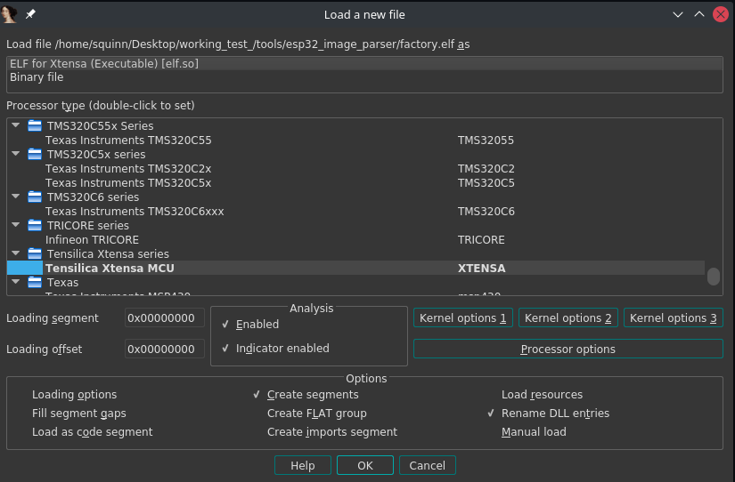
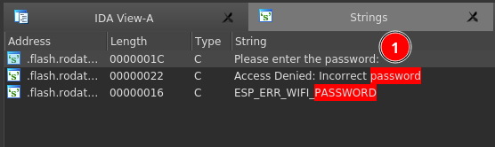
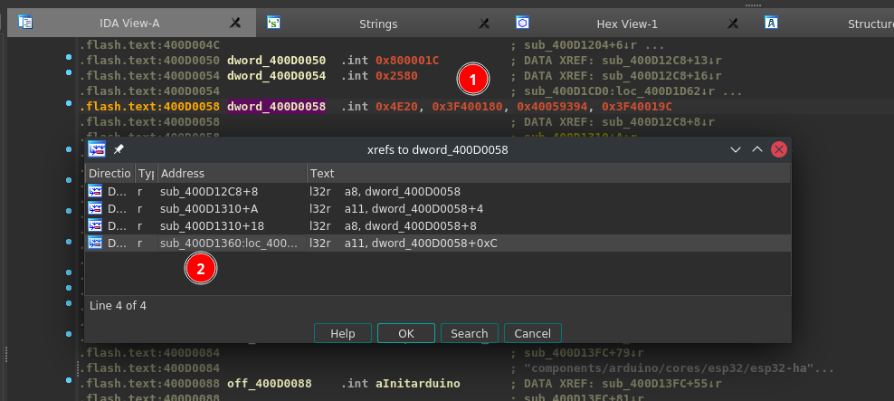
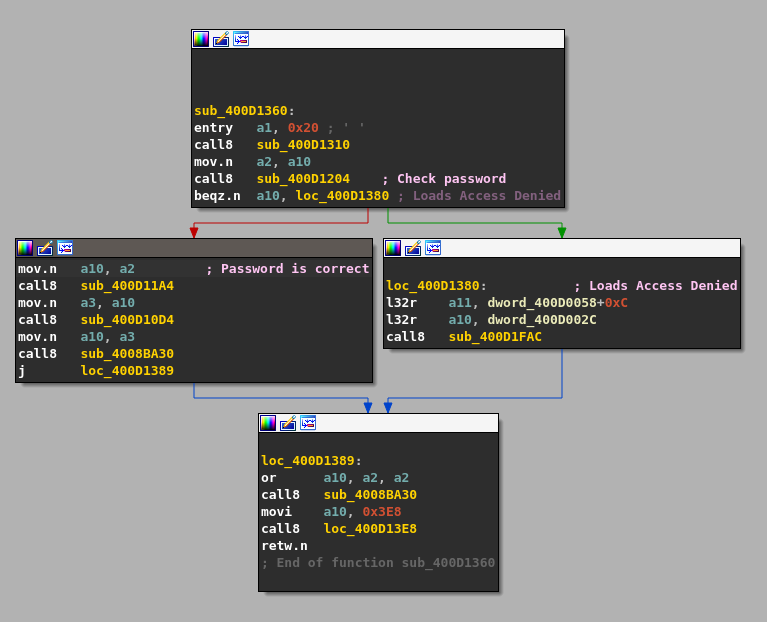
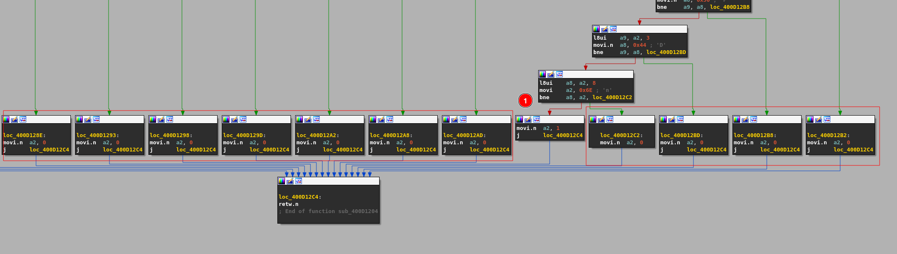
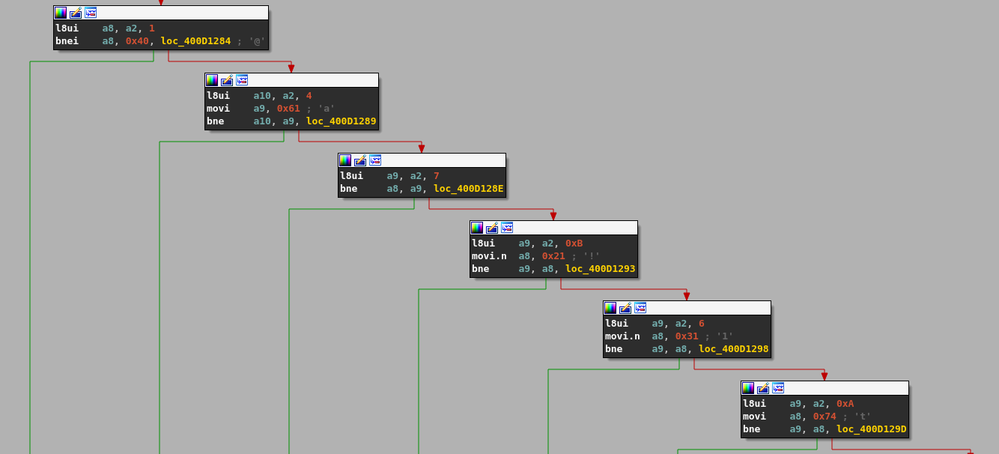

# Solution Write Up for 'esp-challenge'
# Expected Behavior
All that was given was a file called 'flash_image.bin'

Running 'file' on the .bin file returned that it was a DOS executeable.. Which is actually wrong.

```bash
$ file flash_image.bin
flash_image.bin: DOS executable (COM)
```
**Figure:** False output from the "file" command of the flash_image.bin file

Binwalk seemed to give more clues to the true nature of the .bin file.
```bash
binwalk flash_image.bin

DECIMAL       HEXADECIMAL     DESCRIPTION
--------------------------------------------------------------------------------
2828          0xB0C           Unix path: /home/runner/work/esp32-arduino-lib-builder/esp32-arduino-lib-builder/esp-idf/components/soc/esp32/rtc_time.c
6447          0x192F          Unix path: /home/squinn/.platformio/packages/framework-espidf/components/bootloader_support/src/bootloader_utility.c
8361          0x20A9          Unix path: /home/squinn/.platformio/packages/framework-espidf/components/bootloader_support/src/esp32/bootloader_sha.c
8875          0x22AB          Unix path: /home/squinn/.platformio/packages/framework-espidf/components/bootloader_support/src/esp32/bootloader_esp32.c
9845          0x2675          Unix path: /home/squinn/.platformio/packages/framework-espidf/components/bootloader_support/src/bootloader_random.c
11060         0x2B34          Unix path: /home/squinn/.platformio/packages/framework-espidf/components/esp_hw_support/port/esp32/rtc_time.c
45032         0xAFE8          Unix path: /home/runner/work/esp32-arduino-lib-builder/esp32-arduino-lib-builder/esp-idf/components/esp_ringbuf/ringbuf.c

---Snipped---
```
**Figure:** Output from binwalk of the flash_image.bin file.

The flash_image.bin seems to be an esp32 firmware image, witch also matches the common flash size of 4MB.

# Solution
## Opening it in IDA
ESP32 images all contain a RTOS and are usually programmed with one binary to execute at startup and continue in a loop. ESP32 (Xtensa) firmware image store an executeable embedded within and are executed from the bootloader. However the executable is not in a traditional ELF format, but can be converted back.

Using [esp32_image_parser](https://github.com/Yesamwamuo/esp32_image_parser) the partitions of the flash image can be dumped.

```
$ python3 esp32_image_parser.py show_partitions flash_image.bin
reading partition table...
entry 0:
  label      : nvs
  offset     : 0x9000
  length     : 24576
  type       : 1 [DATA]
  sub type   : 2 [WIFI]

entry 1:
  label      : phy_init
  offset     : 0xf000
  length     : 4096
  type       : 1 [DATA]
  sub type   : 1 [RF]

entry 2:
  label      : factory
  offset     : 0x10000
  length     : 1048576
  type       : 0 [APP]
  sub type   : 0 [FACTORY]

MD5sum:
f4ad4f4538564b5d7435b62c75b69524
Done
```
**Figure:** Using the "esp43_image_parser.py to list all of the partitions on the "flash_image.bin" file

There are clearly 3 partitions, and only one with the label of "APP". To extract the ELF executeable from the "factory" partition we use the same script as before.

```
$ python3 esp32_image_parser.py create_elf flash_image.bin -partition factory -output factory.elf
Dumping partition 'factory' to factory_out.bin
Unsure what to do with segment: RTC_DATA

Writing ELF to factory.elf...
```
**Figure:** Using the "esp43_image_parser.py to create an ELF file from the raw flash partition.

To double check the output file can be used again to verify the extraction was correct.

```
file factory.elf
factory.elf: ELF 32-bit LSB executable, Tensilica Xtensa, version 1 (SYSV), statically linked, not stripped
```
**Figure:** Running file on the newly created ELF file

IDA pro or Cutter opens the file without any problems.

\
**Figure:** Loading the ELF file correctly identifies the architecture as XTENSA
## Dynamic analysis
Looking at the binary in IDA pro it can be a bit overwhelming due to amount of functions packed into the elf file. To help narrow down our scope and really figure out what is going on we can emulate an ESP32 and try to run the flash_image.bin as is.

This can be done with [Espressif's Qemu](https://github.com/espressif/qemu). 

Following the well documented [wiki](https://github.com/espressif/qemu/wiki) it was easy to get build.

Instead of creating a new "flash_image.bin" the one provided by the challenge was used.

```
build/qemu-system-xtensa -nographic \
    -machine esp32 \
    -drive file=/home/squinn/Desktop/working_test_/flash_image.bin,if=mtd,format=raw
==2892717==WARNING: ASan doesn't fully support makecontext/swapcontext functions and may produce false positives in some cases!
Adding SPI flash device
ets Jul 29 2019 12:21:46

rst:0x1 (POWERON_RESET),boot:0x12 (SPI_FAST_FLASH_BOOT)
configsip: 0, SPIWP:0xee
clk_drv:0x00,q_drv:0x00,d_drv:0x00,cs0_drv:0x00,hd_drv:0x00,wp_drv:0x00
mode:DIO, clock div:2
load:0x3fff0030,len:7152
load:0x40078000,len:14292
ho 0 tail 12 room 4
load:0x40080400,len:3688
entry 0x40080678
I (1334) boot: ESP-IDF 4.3.0 2nd stage bootloader
I (1354) boot: compile time 14:10:21
I (1379) boot: chip revision: 0
I (1405) boot.esp32: SPI Speed      : 40MHz
I (1409) boot.esp32: SPI Mode       : DIO
I (1415) boot.esp32: SPI Flash Size : 4MB
I (1462) boot: Enabling RNG early entropy source...
I (1535) boot: Partition Table:
I (1537) boot: ## Label            Usage          Type ST Offset   Length
I (1542) boot:  0 nvs              WiFi data        01 02 00009000 00006000
I (1552) boot:  1 phy_init         RF data          01 01 0000f000 00001000
I (1555) boot:  2 factory          factory app      00 00 00010000 00100000
I (1578) boot: End of partition table
I (1618) esp_image: segment 0: paddr=00010020 vaddr=3f400020 size=0d038h ( 53304) map
I (1826) esp_image: segment 1: paddr=0001d060 vaddr=3ffb0000 size=02d80h ( 11648) load
I (1916) esp_image: segment 2: paddr=0001fde8 vaddr=40080000 size=00230h (   560) load
I (1966) esp_image: segment 3: paddr=00020020 vaddr=400d0020 size=21d40h (138560) map
I (2456) esp_image: segment 4: paddr=00041d68 vaddr=40080230 size=0cad4h ( 51924) load
I (2809) esp_image: segment 5: paddr=0004e844 vaddr=50000000 size=00010h (    16) load
I (2938) boot: Loaded app from partition at offset 0x10000
I (2943) boot: Disabling RNG early entropy source...
I (2979) cpu_start: Pro cpu up.
I (2983) cpu_start: Starting app cpu, entry point is 0x400816dc
I (14642) cpu_start: App cpu up.
I (5646) cpu_start: Pro cpu start user code
I (5648) cpu_start: cpu freq: 160000000
I (5650) cpu_start: Application information:
I (5652) cpu_start: Project name:     ESP32_CTF
I (5653) cpu_start: App version:      1
I (5654) cpu_start: Compile time:     Aug 23 2021 14:09:07
I (5660) cpu_start: ELF file SHA256:  c76ff622805d0fc3...
I (5662) cpu_start: ESP-IDF:          4.3.0
I (5681) heap_init: Initializing. RAM available for dynamic allocation:
I (5694) heap_init: At 3FFAE6E0 len 00001920 (6 KiB): DRAM
I (5700) heap_init: At 3FFB37E8 len 0002C818 (178 KiB): DRAM
I (5702) heap_init: At 3FFE0440 len 00003AE0 (14 KiB): D/IRAM
I (5704) heap_init: At 3FFE4350 len 0001BCB0 (111 KiB): D/IRAM
I (5708) heap_init: At 4008CD04 len 000132FC (76 KiB): IRAM
I (5978) spi_flash: detected chip: gd
I (6064) spi_flash: flash io: dio
I (6238) cpu_start: Starting scheduler on PRO CPU.
I (80) cpu_start: Starting scheduler on APP CPU.
Please enter the password:
E (21916) task_wdt: Task watchdog got triggered. The following tasks did not reset the watchdog in time:
E (21916) task_wdt:  - IDLE (CPU 1)
E (21916) task_wdt: Tasks currently running:
E (21916) task_wdt: CPU 0: IDLE
E (21916) task_wdt: CPU 1: loopTask
E (21916) task_wdt: Print CPU 0 (current core) backtrace


Backtrace:0x400D5FF0:0x3FFB06E0 0x40082059:0x3FFB0700 0x400F15F7:0x3FFB6ED0 0x400D6277:0x3FFB6EF0 0x40087CB2:0x3FFB6F10 0x40089749:0x3FFB6F30

E (21916) task_wdt: Print CPU 1 backtrace
```
**Figure:** Watchdog timer going off and rebooting the system.

Not long after booting up the Qemu system it seems to prompt for a "password" and then goes into an infinte bootloop from a watchdog event.

Mashing on the keys allows for a few characters (with no feedback) to be entered and a prompt "Access Denied" even without pressing the "enter" key.

```
Please enter the password:
Access Denied: Incorrect password
Please enter the password:
Access Denied: Incorrect password
Please enter the password:
Access Denied: Incorrect password
Please enter the password:
```
**Figure:** Result from mashing on the keys even without pressing "Enter"

On the [wiki](https://github.com/espressif/qemu/wiki#disabling-the-watchdogs) there is a a note on how to disable the watchdogs of the emulated environment which seemed to work, causing the program to wait on the prompt to enter the password with no reboots.

After a few attempts it was clear that it was looking for 12 characters before submitting the password and the "enter" key was consumed just as any other key.

# Live Debugging
Following the instructions on the [wiki](https://github.com/espressif/qemu/wiki#run-qemu) starting the Qemu emulator with GDB enabled was as easy as appending '-s -S' to the run command.

Once GDB was hooked up an address to break on was needed. Back in IDA Pro searching for the failing string "Access Denied" points to an address in the flash read only data, where xrefs don't work.

\
**Figure:** Searching for strings that we are presented durring execution.

The string can still be located by searching for the 'rodata' address as an imediate value and xrefing that addess which should be in the text section.


\
**Figure:** Using the imediate value search to find the string address in flash memory.

Putting a break point on the last entry in the xrefs based on the "0xc" offset and typing in 12 characters successfully hits our breakpoint, and checking the a11 register can see that the string is indeed loaded at this instruction.

```
(gdb) x/s $a11
0x3f40019c:     "Access Denied: Incorrect password"
```
**Figure:** Checking that the correct string is loaded from flash read only memory.

Presumably the left path is when the password is entered correctly and the right path is when the password is incorrect. Meaning that the code block right above must contain the logic of the password validation.


\
**Figure:** The basic block where passwords are validated.

Knowing that the we need to make the check password function return a "1" to branch left we can consider the only path to a correct password as the path with the red dot #1, everything else must be a fail condition.

\
**Figure:** Identifying the failing conditions and the one pass condition

Putting another breakpoint on the entry of this function it is clear that the "password" typed is passed in with register $a2.
```
(gdb) x/s $a2
0x3ffb5734:     "euaaaaaaaaaa"
```
**Figure:** Password entered and viewed in the $a2 register

looking at the long chain of basic blocks, the password seemes to be checking each character with an offset against a static character. If it is in the correct position and character it continues if not it sets $a2=0 and exits resulting in a "Access Denied".

\
**Figure:** Assembly that checks characters at offsets

So knowing how the password is being checked it is pretty easy to peice together the 12 character long password 'H@kDaP1@n3t!'.

Now armed with the password we can try to enter it into our emulator and see what happens after.

```
Access Denied: Incorrect password
Please enter the password:
Hash: 5c5973cdd0df8db95be0d841f1c11d3882334de0b3023aed27387a9d4cb9561f
Decrypting
PlainText: ARC{You_did_ESP_well_on_this!}
Please enter the password:
```
**Figure:** Typing in the correct password results in the flag

Entering the password the flag is presented.


# Flag
[//]: <> (Add the flag below)
**ARC{You_did_ESP_well_on_this!}**
