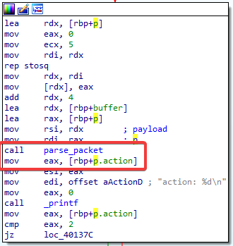

# Solution Write Up for Free Yo Radicals Part i
# Expected Behavior
The provided [server_binary](challenge/server_binary) listens on port `9999` for traffic. Also provided is two pcaps with examples of traffic from "normal" usage of application, [capture1.pcap](capture1.pcap) and [capture2.pcap](capture2.pcap).  By the nature of the challenge setup, we also provide that the server binary listens on port 9999.

The binary can be executed by simply running it on the commandline on a x64 Linux machine.

```bash
# Start the Server
./server_binary
```

Although it can be executed, it is not expected for this challenge to require to perform dynamic analysis.  The binary is provided to pair with the provided pcaps to perform static reverse engineering of the proprietary protocol.

# Solution

Like many reverse engineer exercises there are multiple ways to approach and solve this challenge, the provided steps are simply one way chosen by the authors.

1. Review the provided pcap files for characteristics of the unknown protocol that stand out through basic visual inspection.

Lets start with capture1.pcap:


The first thing we can notice is the pcap is made up of entirely (1) TCP packets, 19 to be exact.  This means we will understand that the only packets that contain meaningful data are packets with the PSH flag set.  This helps bring our analysis down to about 7 packets from 19.

Second since we are told from the prompt that the server binary listens on port (2) 9999, we can clearly identify that the first packet is from the client to the server. This helps us to concretely understand which IP is assigned to which for our example pcap.  (3) 192.168.7.68 for the server and (4) 172.22.236.44 for the client.

Now lets take a quick look at our second sample to see if we have the same basic structure:


We can see the identical number of packets and structure for both pcaps.  This is extremely helpful to know we have some basic consistency between captures for our analysis and anything which is different is therefore meaningful. We can now move back to our first capture and focus on only the PSH packets which contain a payload. We can add this filter by using the following syntax in Wireshark:

```
tcp.flags.push == 1
```
We are not greeted with only 7 packets and can see a few other patterns which are worth noting.


Here we can see that all the packets from the client to the server are of the same size.  This indicates we may have a reasonability well defined protocol structure and this may be one type of packet worth studying. In contrast the packets from server to client are of slightly different sizes, but still similar.  This could still be a will defined protocol, but is clearly different from the previously mentioned client to server and should be treated as a different type.

Another good resource for beginning analysis of proprietary protocols is strings.  One easy place to see all the strings from a TCP stream is by using Wireshark's "Follow TCP Stream" function.


If we look at the window which displays the screen we can see a number of strings or ASCII text which informs us further about the protocol.


(1) The red text is the client packets and the blue text is the server packets which can be seen in the large white space (2).  

From the server side traffic we can see the "Waiting for data..." string which is repeated several times in addition to a few additional strings. Since we have the server side binary, this is a great string to take note of as a place to start our static analysis of the binary. We can see that the strings are not all the same length, which could be an indication of why the server's response packets are slightly variable in length.

From the client side traffic we notice "DN13.vo" and "HM13.Vo" which at first glance appear to be nonsense. However if we now compare this output to our other pcap file we can see some interesting insight.


In `capture2.pcap` when we follow the TCP stream we have slightly different data.  Here we can see the client sending a similar but different (1) string, "DM06.cs" from capture1.pcap but in this case the server sends back (2) "mSv: 120 Location: DM06cs". The first thing that stands out is the server has removed the "." from the "DM06.cs" string making it one continuos string and added the identifier "Location".  Recall that any non-ascii value in Wireshark will be displayed as a "." when viewing ascii.  We will likely want to return to the true binary data if we wish to dig into this value further, however with the context provided by the keyword "Location", we can google the phrase resulting in quickly identify these as grid square coordinates.


While the keyword location stood out immediately, the location string was the second part of the response by the server.  If we use the same approach and assume "mSv" is an identifier of some kind, Google illuminates its purpose is to represent "sievert", a unit in the International System of Units intended to represent the stochastic health risk of ionizing radiation.  This aligns with our story for this challenge and therefore indicates the "120" is likely the amount of radiation.


If we return to the TCP stream from capture2, the output clearly demonstrates a difference in the conversation from capture1 to capture2.  Here in capture2 is the only time we don't see, what we now understand to be grid coordinates being sent to the server.  Instead we see the client sent a mostly non-assci packet (1) where the serer returns coordinates (2) to the client.  In every other interaction we see the client sending coordinates and then the server "Waiting for data...".


This change in the flow indicates there is a different type of operation happening although we can't determine easily exactly what, we should note the change in the flow before continuing.

To recap, from basic visual inspection using Wireshark we have learned the following:

1. The protocol is built on-top of TCP
2. The server listens on port 9999
3. The server IP address is 192.168.7.68 and the client ip address is 172.22.236.44
4. The server sends strings such as "Waiting for data...", which can be used to assist in static binary analysis.
5. In most of our example traffic, the client is sending grid coordinates to the server where they are split after 4 bytes by a non-ascii byte.
6. In one case the client doesn't send any printable data and the server response with grid coordinates and a numerical value representing radiation levels.

2\. Static analysis

Before embarking on deep static analysis, its a good idea to utilize a tool such as `file` to help understand the basics of the binary.


We learn from using the `file` command that we are dealing with a 64 bit binary that has **not** been strip and therefore has the debugging symbols left behind.  This will definitely help aid our static analysis.  Using a disassembler such as IDA Pro we can now analyze the provided server side binary.  One of the best places to start is to view the strings. By looking at the strings in the binary we find a group which help shed some light on key functions.  


1. "mSv" and "Location" format strings- we have already determined these are in the packet from `capture2.pcap` and believe we understand there meaning.  We can use this strings to learn more about this code.
2. "./flag" - this is of key interest to us as its the goal of this exercise.  With the "./" it is likely this this is a file path.  While we weren't provided this file, we can understand the logic required to obtain the flag.
3. "Error: Found bad deliminator, Invalid packet" - This implies that there is some type of validation happening for each packet which is received.  It also tells us that the protocol has a "deliminator" which is required in the payload.  If we need to send packets to the server we will need to understand this logic.
4. "Error: Incorrect termination, Invalid packet" - This further confirms there is validation being performed on the packet, emphasizing the need to understand the payload.  This also tells us there is a "termination" character.  We can investigate the section of code which uses this string to learn more.
5. "Valid packet" - this is likely the inverse of the strings above and will bring us to the code path which executes when a good packet is received.
6. "Connected" , "Waiting for data", "Bye bye!" - these are all strings we saw from the server in the pcap.  Investigating these code blocks would help us understand what conditions are required for these to be sent.  The text itself does provide some assumptions which can be made for Connected and "Bye, bye!" as they are likely welcoming and ending strings.
7. "action" - this is new to us and should be noted as something that may provide value to return to as we learn more.
8. "Created new coordinate", "Created new radiation value"- These string validates our belief that the value after "location" is a coordinate and after "mSv" is a radiation value.  The code around these strings could provide some insight on how they are created or potentially stored.
9. "Error: Termination char found in coordinate" - this further shows validation happening, but here for looking for the "termination char" within the coordinate".  
10. "Deleted requested coordinate" and  "Deleted requested radiation value" - this tells us coordinates and radiation values can be deleted not just created.

With all of this context, lets start by looking at the code surrounding the "./flag" string. 


By cross referencing the string, we find its only used in one function.  Since debugging symbols were not stripped, we can see this function is named "print_flag", clearly confirming "./flag" is likely a file which is printed.  So what conditions need to be true for "print_flag" to be called? 


`print_flag` is only called in (2) one place. In order to reach this code path we see several binary checks on a variable named (1) "ops_completed". If we continue to investigate we will find that there are 4 checks each which need to be true in order to reach this path.


Each check is guarded by a case statement of values 1,2,3 and 5. If we look at the top of the case statement we get a clue based on a print statement that this has todo with the "action" string we saw earlier.  



Examining the code surrounding the print statement more closely, after a function named `parse_packet` is called, we see a structure named "p" with an "action" member. By looking at the parse packet header we can see "p" of type "packet" and "payload" of type "int*" are passed into `parse_packet`. It is logical to assume here that packet is the output after parsing the payload. 


This means that our "action" comes from the packet.  Since debugging information was left in the binary this means we also have the structured defined for the `packet` structure.  This gives us a rosetta stone to understand our proprietary protocol.


Lets now take another deeper look at the TCP payloads across both captures.  From our static analysis we should be able to observe this defined structure for the packets from the client to the server. Starting with the very first packet sent from the client to the server in `capture1.pcap` we should be able to identify the first field of `payload_ip`.  IP addresses in payloads are easy to spot since we can use the IP layer to give us exactly what we are looking for.  Notice we can highlight the IP address in the IP layer and then look in the payload for the matching bytes.  Of course we don't know 100% wether to expect the source or destination, but with only two options we can quickly try both and find teh source IP address is indeed the first 4 bytes of the payload!


If we continue to follow the structure definition found in the binary, we expect to find the port number after the IP address. We can use the same technique for finding the value by highlighting the port numbers in the TCP layer and looking for a match.


Here we find that the port number is the destination port but also something odd stands out.  From our static analysis we expect the port number to be directly after the IP address, however we see this is not the case, there is a 0x0e in between our IP address and port number.  If we keep looking we can also notice there is a 0x0e after the port number.  In fact we can find 0xe many times throughout the payload.


If we consider the placement of these 0x0e values in addition to the structure defined in the server binary, you can logically see a potential field separator.  Recall from our string analysis - "Error: Found bad deliminator, Invalid packet".  This makes an even stronger case that we have found this "deliminator". Lets see if we can verify this by looking for this string and the code and identifying if 0x0e is what is being checked.


Using the string (1) as a pivot point, we can find that a variable named "deliminator" is being checked in a function named (3) validate. By investigating the value of this variable (1), we indeed see that it is a constant set to 0x0e.


We additionally learn a piece of bonus information.  There is another constant defined in the code right after the "deliminator" value named "terminator" (2) which is set to 0x0c.  If we go back and look at our packet again we can see this value is indeed the last character sent.


Understanding the deliminator and the terminator we can quickly break out the rest of the fields using the structure from the binary.  If we take packet #6 from `capture1.pcap` and match it up with the structure definition we end up with the following:

* payload_ip - ac 16 ec 2c
* payload_port - 20 0f
* timestamp - 63 65 80 b0
* action - 00 01
* datafield_1 (16 bytes, split with deliminators) - 44 4e 31 33 76 6f 00 00 00 00 00 00 00 00 00 00
* datafield_2 00 00 00 00 00 00 01 40

Since our goal is to execute the code path that opens and sends the data in "./flag", we need to focus on the action field and determine how to execute 1,2,3 and 5 actions. Packet #6 and #10 we can see it has a value of 1, but packet 14 appears to be different with a value of five (1).  This is great since we now have an example of two different types, but what is the differences?


Packet 14 which has the action value of 5 has all of the same values leading up to the action field, however the fields following appear to be (2) null. This implies they have a different function in this use case. If we revisit our TCP stream output we can also see we get a different response. 


When the packet with action 5 is sent, the server responds with "Bye, bye!". This implies that action 5 may be an exit command and we can use this packet as a guideline for the format required.  Thinking back to the other packets we have seen with an action 1 we can take one of two approaches.  We can take an educated guess with the information we have, knowing we can use the provided packet and defined struct to craft an "action 1" packet; or we can reverse the code to get a full proof understanding of what action 1 represents. For the purpose of this write up and exercise, an educated guess is good enough to move on since we only need to send the proper format to get the flag.  We can investigate in more detail the purpose of this action in more detailed if required later on.

Based on our understanding of the applications purpose and coordinate data we have discovered in the action 1 packets, it is reasonable to believe action 1 likely has todo with adding data to the system.  We can also leverage the fact that we see a message from the server each time after an action 1 packet that states "Waiting for data...".  As needed we can use reversing to confirm this at a later time if necessary and can move forwards with this assumption.

If we move on from understanding action 1 and 5, we are still in need to understand actions 2 and 3 (recall through reversing we never saw an action 4).  Unfortunately `capture1.pcap` doesn't appear to have any examples of either of these actions.  Lets check `capture2.pcap`. Looking at only the PSH packets in our capture that are going from client to server we can see packet 6 is another action 1 packet, packet 10 is an action 3 packet and packet 14 is another action 5 packet.  This is great as we have discoverd one of the two missing action types as an example!


If we dig into this TCP stream while still looking at the packet payload, we can find a few more context clues about this packet type.


First it is noticeable that like the previous action 5 packet there is no data (1) present in our payload outside of the deliminator and terminating characters. However when we look at the response from an action 3 it is very different from and action 5.  Here it appears that data being sent in the action 1 packet (packet 6) is being echoed back in the response.  Lets see if we can get any additional clues from the disassembly by studying the code flow for action 3.


Often error messages since they are simply hardcoded strings, provide more information than the code doing the heavy lifting.  Here we see in the code path for action 3 an error message about "no entries to print".  This tells us that action 3 is likely attached to printing stored data.  Since `capture2.pcap` shows us the data being printed is the data in the action 1 packet, it is also safe to assume that action 1 is adding data, confirming our previously hypothesis.

So now we understand and have an example for 3 of the 4 code paths we must execute in order to get to "./flag".  Unfortunately, with only two packet capture it doesn't appear we are left with any examples of action type "2".  This means we will need to solely depend on static code analysis and what we have already learned in order to understand this packet type.  If we start to investigate the code path for action 2, we find that print statements and variable names very helpful.


One of the print statements (1) that stand out in this code path is "Deleted requested radiation value".  This tell us pretty plainly that action 2 is likely a delete.  In addition we can see in this path that "datafield_2" from the packet (2) is being compared. Since we understand from our defined structure that datafield_2 is the last 8 bytes before the terminator, we can conclude that we need to put the radiation value we want to delete here in our request.  If we keep digging we will find the same is true for "datafield_1" and the message "Deleted requested coordinate", where datafield_1 is the 16 byte field from our packet. The fact that there are two different delete functions both tied to the action value of 2 maybe because that each coordinate and radiation value is stored in their own struct.

Now armed with the general template of the network packet, we can craft a delete packet very similar to a create packet but of course changing the action value. The reason that the delete packet needs to look like a create packet is due to the check shown in the above screenshot where for the delete to execute successfully it must have the correct value in either "datafield_1" or "datafield_2".

The last step will be either to replay the network traffic making sure to include every action (1, 2, 3, 5). We already have a pacet for 1, 3, and 5, also it is clear from looking at the server binary that the IP address, port, and timestamp are not parsed out of the packet. So in theory we can replay the exact packets from the pcaps and only change the action to retreive the flag.

A quick and dirty way of doing this can be shown below.

```python
import socket
import time
from scapy.all import *

# Read each packet from both pcaps
packets1 = rdpcap('./capture1.pcapng')
packets2 = rdpcap('./capture2.pcapng')
# Concatinate the two packet captures.
all_packets = packets1 + packets2

dst_ip = '127.0.0.1'
dst_port = 9999

# Dictionary to save all packets needing to be replayed
saved_actions = {}

# Read all packets in
for pkt in all_packets:
    # Find only the PSH packets sent from the client to the server
    if pkt['TCP'].flags == 'PA' and pkt['IP'].src == '172.22.236.44':
        # The "Action" value is at offset 14
        action = pkt[Raw].load[14]
        # Save each action once
        if not action in saved_actions:
            saved_actions[action] = pkt[Raw].load

# Add missing delete function, very similar to add.
saved_actions[2] = saved_actions[1][:13] + b'\x00\x02' + saved_actions[1][15:]

# Send all the packets over to the server.
s = socket.socket(socket.AF_INET, socket.SOCK_STREAM)
s.connect((dst_ip, dst_port))
for i in [1,2,3,5]:
    s.send(saved_actions[i])
    time.sleep(.2)
    print(s.recv(1024))

s.close()
```

The out put should look like this:
```
b'Connected\n\nWaiting for data... \n\nWaiting for data... \n'
b'\nWaiting for data... \n'
b'\nWaiting for data... \n'
b'ARC{PR0pr137aRy_pr070C0L5_Ar3_1337}\n\n[+] Bye bye!\n'
```

Another, probably more elegant solution is  to create something like a scapy layer to define this protocol. A scapy layer defining this protocol can be found in this file [proto_util.py](solution/proto_util.py). 

## Supporting solution info
Solution script: [level00.py](solution/level00.py)
protocol definition: [proto_util.py](solution/proto_util.py)

### Usage: ```python3 ./level00.py```

### Expected output:

``` bash
[*] '/projects/CTF/2023_ctf/Free_Yo_Radicals_Part_i/challenge/server_binary'
    Arch:     amd64-64-little
    RELRO:    No RELRO
    Stack:    Canary found
    NX:       NX enabled
    PIE:      No PIE (0x400000)
[+] Opening connection to localhost on port 9999: Done
[+] Connected
[+] Sending create
[+] Sending print
Received data: mSv: 1337 Location: AAAABBBBCCCCDDDD
Waiting for data...

[+] Sending delete
[+] Sending print
Received data:
Waiting for data...

[+] Sending goodbye
[+] Receiving all data: Done (50B)
[*] Closed connection to localhost port 9999
[+] Flag is: ARC{PR0pr137aRy_pr070C0L5_Ar3_1337}
```

[//]: <> (Give an explanation of the code and how to run it here. Make sure to explain the correct output so that anyone following allong can verify that it is running correctly.)


# Flag
[//]: <> (Add the flag below)
**ARC{PR0pr137aRy_pr070C0L5_Ar3_1337}**
