# Solution Write Up for 'Rusty Snek'
# Expected Behavior
Given the description of the challenge "Beat the game or not to get the flag" it makes sense to try the game out first.

\
**Figure: Normal game play**

Seeing that after around 7 or 8 points it seems to speed up far past what most people could manage to controll there must be a better solution to solving this challenge.

# Solution
## 1. Load it into GDB to figure out some of the game logic

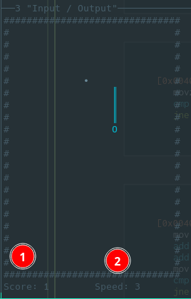
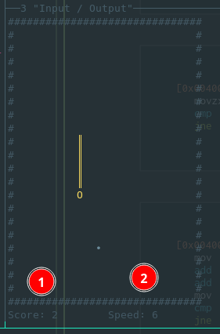\
**Figure:** Speed incrementing by 3 and Score by 1

The score seems to increment by one point (which makes sense), but the speed seems to increase by 3 each time the snake eats.

---

## 2. Searching for the speed varible

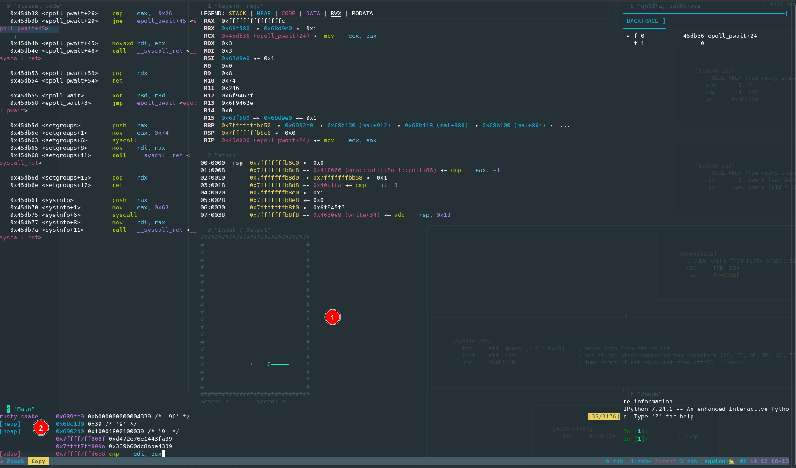\
**Figure:** Pwndbg search feature for speed varible

>Red Dot #1 - Game play with speed == 9\
>Red Dot #2 - pwndbg searching stack, heap, and other memory for the value "9" (Found in heap)

## 3. Add a hardware breakpoint on potential speed varible

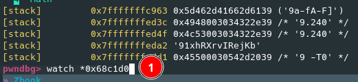\
**Figure:** Setting hardware breakpoint for write access

>Red Dot #1 - Setting a hardware breakpoint on write for the potential speed varible

## 4. Replay with hardware breakpoint set

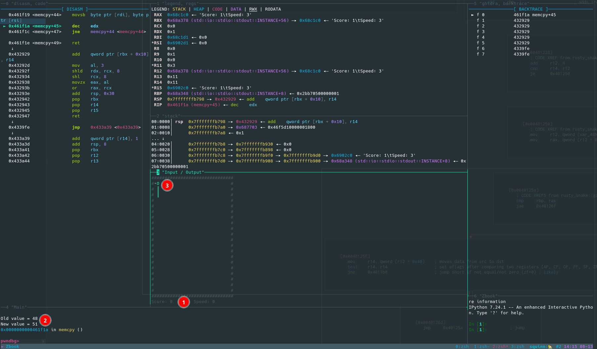\
**Figure:** Playing the game with a hardware breakpoint on the potential speed varible

>Red Dot #1 - Score is 0 and the speed is 0\
>Red Dot #2 - Speed is (0 == 0x39 == 48) and it is being incremented by 3 to 51.\
>Red Dot #3 - This is all happening before the head of the snake actually touches the food dot.\

 Dynamically changing this vaule using GDB didn't work for me and I think it is becuase all of Rust's varibles are immutable so only the referenced copy gets changed and the speed continues to climb. This is why I took the approach of patching the game to not increase the speed.

## 5. Open the game binary into Cutter.

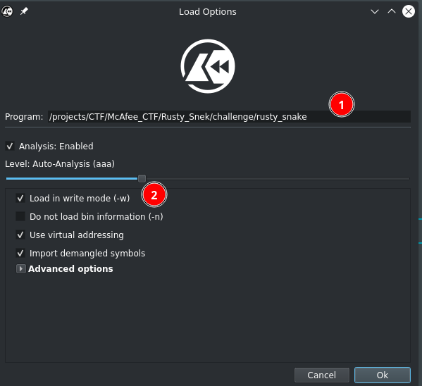\
**Figure:** Opening the binary in cutter

>Red Dot #1 - Open the game binary\
>Red Dot #2 - Since we will be patching the binary open it "write" mode

## 7. Narrow down static analaysis

To narrow down the functions we need to look at we can search for "rusty" and see if anything catches our eye.

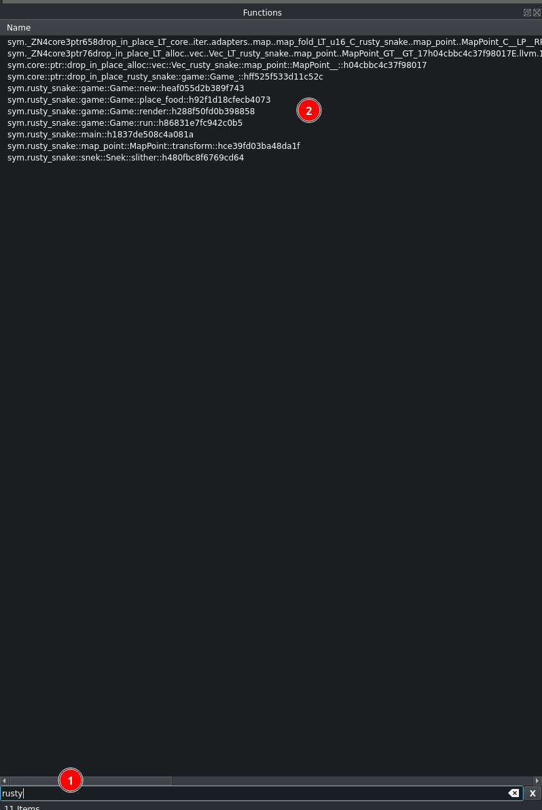\
**Figure:** Searching for "rusty" in cutter

>Red Dot #1 - Searching for "rusty"\
>Red Dot #2 - Interesting functions.\

## 8. Corelate functions to game play
Given that the scoring happens before the slithering of the snake we can XREF the slither funciton and see where that is called

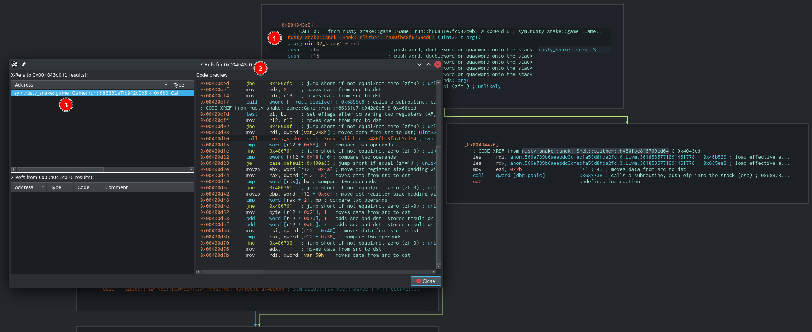\
**Figure:** Cross Refrencing the "slither" function back to the "run" function

>Red Dot #1 - Slither function (Press "x" to see the XREFs)\
>Red Dot #2 - All occurences of the Slither function (only one in the binary)\
>Red Dot #3 - The only call to the funciton is in the Game::Run function

## 9. Look for places where the speed is increasing around the slither function

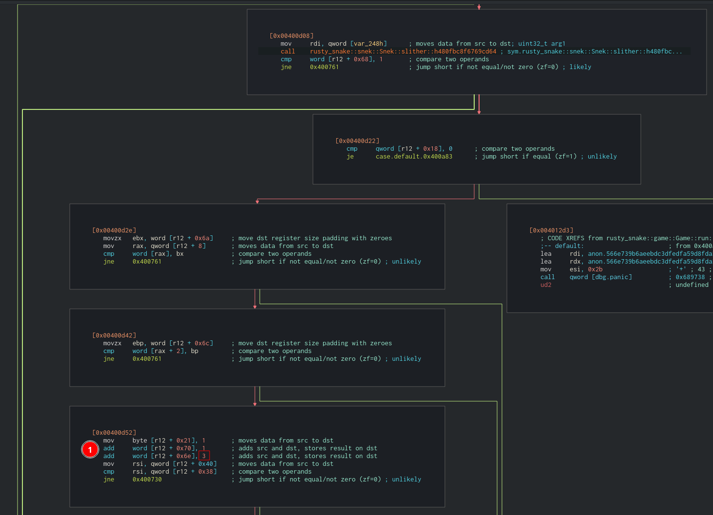\
**Figure:** Function block that looks to be incrementing score and speed

Remembering that the score is increased by 1 and the speed is increased by 3 the Red Dot #1 seems like that might be where things are getting incremented by. This was easily validated by running the binary again in gdb and decrementing the [r12 + 0x6e] memmory address by 3 each time scored. But it was hard to continue stearing the snake after the patch from gdb. Making the idea of pathing the binary a better solution.

## 10. Patching the binary

For some reason cutter kept crashing if I tried to edit from the Graph view so I am editing it here in the hexdump view.

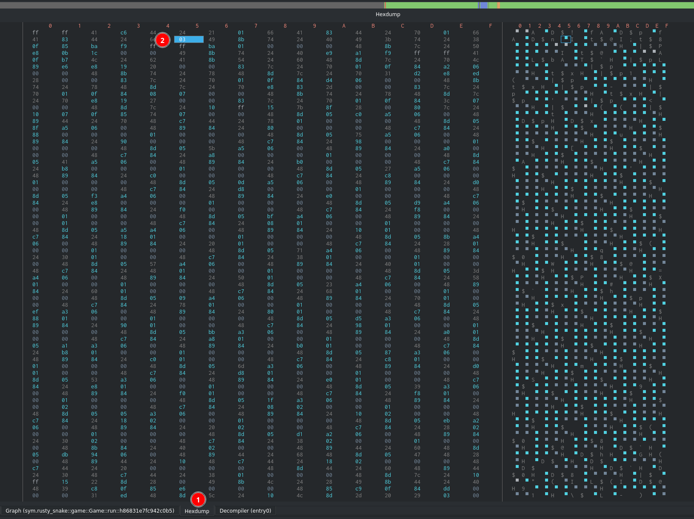\
**Figure:** Finding the 3 that increments the speed

>Red Dot #1 - Select Hexdump mode\
>Red Dot #2 - Find the 03 which coresponds to the increment of the speed variable.

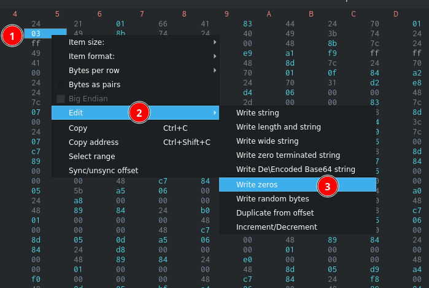\
**Figure:** Edit the binary to write zeros

>Red Dot #1 - Right click the "03"\
>Red Dot #2 - Select edit from the dropdown menu\
>Red Dot #3 - Select Write zeros (Since we want to increment by 0)

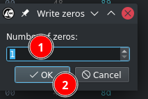\
**Figure:** Select number of zeros to write

>Red Dot #1 - Only write 1 zero\
>Red Dot #2 - Confirm changes

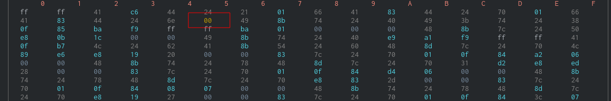\
**Figure:** Confirm changes

Validate that the 3 is now 0 

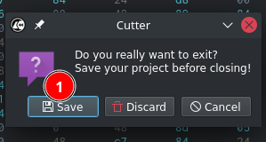\
**Figure:** Save changes and exit

>Red Dot #1 - Save and exit cutter

## 11. Now just play the game which doesn't increment the speed and win!

\
**Figure:** Play on easy mode to get the flag

# Flag
**ARC{NO_STEP_ON_SNEK}**
