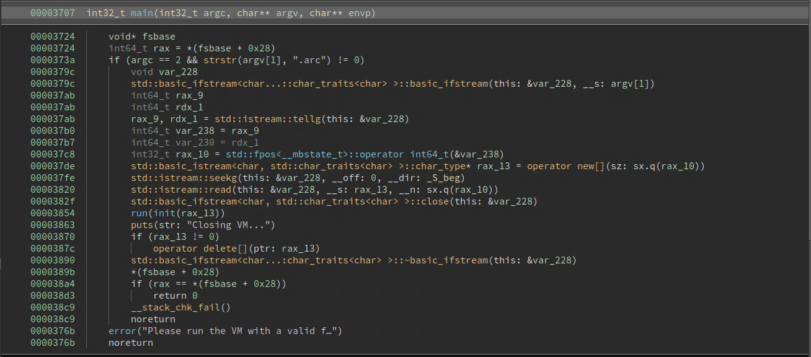
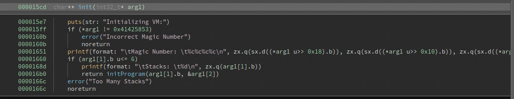
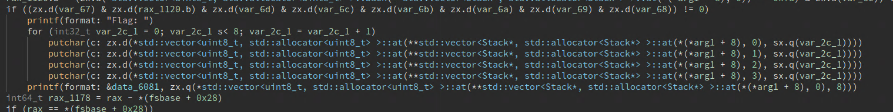
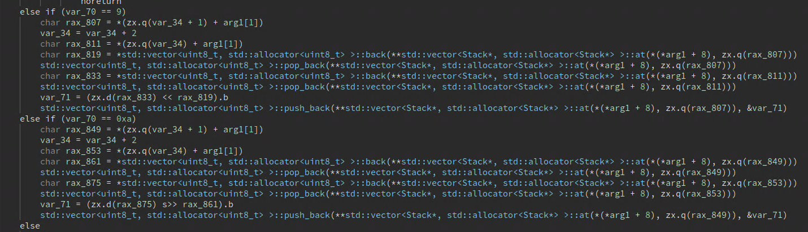
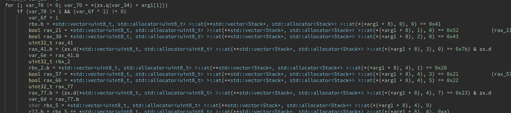

# Solution Write Up for Stacks on Stacks
# Expected Behavior


```bash
./vm 

Please run the VM with a valid file
```

# Solution


**Figure 1:** Programs main function

1. Opening up the binary in a decompiler we can see the main function. From here we can see:
	-  The program expects one command line parameter and the parameter ends in .arc.
	- The program uses ifstream on the argument so its most likely a file.
	- We need to look into the init and run functions.



**Figure 2:** Programs init function

2. Looking into the init function we see that there seems to be a header in the .arc file format that specifies two thing. A magic number and a number of stacks, this value has to be less than or equal to 6.



**Figure 3:** Flag print inside run function

3. Inside the run function we can see that near the bottom of the function the program checks several values and then if true it prints out the flag and some values from stacks 0-3.
	- There is a check here to see if the last value on stack 0 is equal to 0x7d.



**Figure 4:** Opcodes in an interpreter

4. Looking through the rest of the function you can see that there are several ifs that appear to check the current value after the header (plus increments) to some value and then does operations, so this is most likely bytecode commands. From this we can reverse:
	- The bytecodes are:

```
HALT        0x00
STORE       0x01
POP         0x02
POWER       0x03
MULTIPLY    0x04
DIVIDE      0x05
MODULO      0x06
ADD         0x07
SUBTRACT    0x08
LSHIFT      0x09
RSHIFT      0x0a
AND         0x0b
XOR         0x0c
OR          0x0d
MOVE        0x0e
```

 
5. There are a few operations that seem to have extra checks, these are:
	- ADD
		- Activates when the length of stack 4 is 25
		- Reads 4 values off stack 4 in backwards order and checks:
			- val_0 ^ val3 == 48
			- val_1 ^ val3 == 108
			- val_2 ^ val3 == 106
	- SUBTRACT
		- Activates when the length of stack 4 is 25
		- Reads 4 values off stack 4 and checks:
			- val_0 ^ val3 == 104
			- val_1 ^ val3 == 55
			- val_2 ^ val3 == 108
	- AND
		- If val0 and val1 are equal then save the AND value and increment a counter.
		- Once the counter is greater than or equal to 4 the program checks:
			- val_0 & val_1 == 36
			- val_0 & val_2 == 100
			- val_1 & val_2 == 38
			- val_1 & val_3 == 52
			- val_0 + val_1 + val_2 + val_3 == 317
			- val_0 + val_1 + val_3 == 207
			- val_0 + val_1 + val_2 == 265
			- val_3 + val_1 + val_2 == 217
	- XOR
		- If the first val is 0x23 then save off xor to val_3
		- If the first val is 0x22 then save off xor to val_2
		- If the first val is 0x21 then save off xor to val_1
		- If the first val is 0x20 then save off xor to val_0
			- Then perform additional checks:
				- val_0 ^ val_1 == 92
				- val_0 ^ val_2 == 25
				- val_0 ^ val_3 == 94
				- val_1 ^ val_2 == 69
				- val_1 ^ val_3 == 2
				- val_2 ^ val_3 == 71
				- val_0 ^ val_1 ^ val_2 ^ val_3 == 27
				- val_0 ^ val_1 ^ val_3 == 111



**Figure 5:** Initial Checks

6. There are also a few checks that are before the opcode checks, these seem to check values on certain stacks. One of the checks in the if before this section is also checked in the store instruction and if true the program exists. This means that you have to store all your values onto the stacks before you do any other instructions, and once everything is stored these checks are done. These checks tell us that:
	- The 0th value of stack 0 is 0x41
	- The 0th value of stack 1 is 0x52
	- The 0th value of stack 2 is 0x43
	- The 0th value of stack 3 is 0x7b
	- The 1st value of stack 4 is 0x20
	- The 3rd value of stack 4 is 0x21
	- The 5th value of stack 4 is 0x22
	- The 7th value of stack 4 is 0x23
	- The 9th value of stack 4 is equal to the 10th value of stack 4
	- The 11th value of stack 4 is equal to the 12th value of stack 4
	- The 13th value of stack 4 is equal to the 14th value of stack 4
	- The 15th value of stack 4 is equal to the 16th value of stack 4
	- The 20th and 21st values of stack 4 are 95
	- The 1st, 2nd, and 3rd values of stack 0 are B_r
	- The 1st, 2nd, and 3rd values of stack 1 are 0te
	- The 1st, 2nd, and 3rd values of stack 2 are 0h_
	- The 1st, 2nd, and 3rd values of stack 3 are m3g

7. Once all conditions are found you can either make a .arc file:

```
53 58 42 41 05 00 00 00 01 00 41 01 01 52 01 02 43 01 03 7b 01 04 7d 01 04 20 01 04 4d 01 04 21 01 04 10 01 04 22 01 04 56 01 04 23 01 04 10 01 04 34 01 04 34 01 04 6e 01 04 6e 01 04 37 01 04 37 01 04 64 01 04 64 01 04 37 01 04 68 01 04 33 01 04 5f 01 04 5f 01 04 35 01 04 33 01 04 6f 01 00 42 01 00 5f 01 00 72 01 01 30 01 01 74 01 01 65 01 02 30 01 02 68 01 02 5f 01 03 6d 01 03 33 01 03 67 07 08 0b 04 04 0e 00 04 0b 04 04 0e 01 04 0b 04 04 0e 02 04 0b 04 04 0e 03 04 0c 04 04 0e 03 04 0c 04 04 0e 02 04 0c 04 04 0e 01 04 0c 04 04 0e 00 04 0e 00 04 00
```

Or you can make a z3 script to solve the constraints:

## Supporting solution info

### Usage: ```python3 ./assets/solve.py```

### Expected output:

```
ARC{B00m_th3re_go35_7h3_d7n4m1t3}
```


# Flag
[//]: <> (Add the flag below)
**ARC{B00m_th3re_go35_7h3_d7n4m1t3}**
