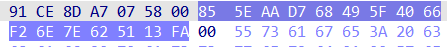
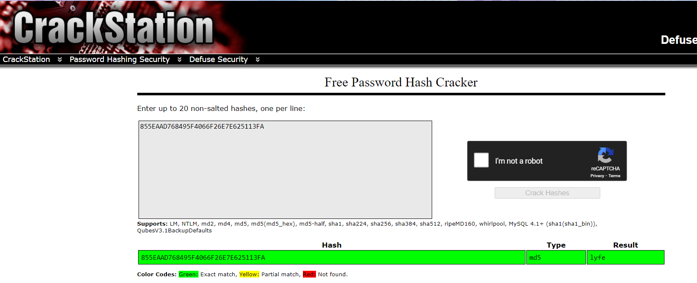

# Solution Write Up for 'The Governor's Secret'
# Expected Behavior

Running the challenge without argument will print the usage message.
An invalid flag will print an error message.


```bash
./chal
Usage: chal password


./chal test
Nope

./chal ARC{XXXXXXXXXXXXXXXXXX}
Try Again!


```

# Solution

Opening the challenge in IDA Pro and looking at some of the function responsible for parsing the flag show various interesting things.
First IDA doesn't recognize the functions as such, and fails to dissassemble fully. This is because the code is obfucsated. By selecting the valid instruction and marking them as procedure, it is possible to force IDA to define a function, which can then be looked into hex-ray decompiler: 


The code first "decode" two magic values `0x1A1A517551752A12` and `0x1A1A42429CEF2A12` by xoring them with `0x42`. These two values are then searched (as byte-strings) starting from the current location in the code (`&loc_15A2` in the screenshot above).

Decoding these two values (as byte-string rather than QWORDs) we obtain: 

- `\x50\x68\xAD\xDE\x00\x00\x58\x58`
- `\x50\x68\x37\x13\x37\x13\x58\x58`

This two byte-strings can actually been dissassembled as valid x64 assembly as `push rax; push $value; pop rax; pop rax` with `$value` either `0xDEAD` or `0x13371337`.


The results of the `memmem` calls are then stored in global variables and are later used as start and stop point for the deobfuscation and reobfuscation of the function. That is to say these two byte-strings are valid code blocks (performing what is functionally equivalent to NOPs) that are used as markers to indicate the beginning and end of an obfuscated region. 

The obfuscation algorithm itself is simple and can be described in pseudo code as: 

```c
    for (u64 i=0; i < obfuscation_end - obfuscation_start; i++)
    {
       (*(unsigned char*) (obfuscation_start + i)) ^= (i % 0x100);
    }
```

Note: The marker itself is not included in the obfuscation scheme, hence the `+8` after the second `memmem`.

A simple deobufscation script can then be written that will look for all the instances of these markers, and run the same xor algorithm (see `src/obfuscate.py`, with this algorithm, obfuscation and deobfuscation can be run with the same script).

Now the binary is deobfuscated, we can look further at its logic:


The four function calls on lines 18 to 21 need all to return a non-zero result (`true`) for the flag to be printed. We can call them `check1` to `check4`. Let's go over them!

## Check1 


We can in the screenshot above the deobfuscation/obfuscation routines (lines 34-35 and 41-42) sandwitching the actual function of the check which in this case verifies that the length of the flag is 23.

## Check2 


The second check verifies that `a1` (the pointer to the flag submitted by the user) starts with `ARC{` and ends with `}`.

## Check3 


The third check is a little more complicated. It skips the first 4 bytes of the flag (the `ARC{` header) and compare the following `v4` bytes of it with `asc_302A[2*i] + asc_302A[2*i+1]` where `asc_302a` is a c-string of length `2*v4`. To retrieve the exepcted value of the flag, we can do the following 

```python
import binascii
import struct
magic_blob = binascii.unhexlify("202F7CE69FC785F03D36A5BED0642A4A551471BF363891CE8DA70758")

res = b""
for i in range(0, len(magic_blob)//2):
	res += struct.pack("B", (magic_blob[2*i] + magic_blob[2*i +1]) % 0x100 ) # The modulo 0x100 is important because the operation in c is done over "char" so the addition will overflow. 

print(res)  # b'Obfusc4ti0n_4_'
```

Which returns: `Obfusc4ti0n_4_`

## Check4


The last check is a little more complicated. It takes the remaining data of the flag (starting at offset `18`) and pass it through various mystery functions. The end result of this operation is `memcmp` with 0x10 bytes.

Looking at the `mystery_func1` we can see the following: 


This function is clearly an initialization of some sort. 
Searching the internet for magic values is always a good idea in order to save reversing time. In this case, googling the value highlighed in yellow immediately leads to `md5` implementations. 

Through a little gueswork we can assume that the three mystery functions are `MD5_Init`, `MD5_Update` and `MD5_Finalize` of some standard library. And the `memcmp` with `0x10` bytes is likely the raw-memory comparision of the expected MD5 hash of the final flag chunk. 

Looking at the hash we see:



Which can be fed into an online cracker: 


Hence the final chunk of the flag is `lyfe`

## Result

Puting the various checks together, we can identify that the final flag is `ARC{Obfusc4ti0n_4_lyfe}`


# Flag
[//]: <> (Add the flag below)
**ARC{Obfusc4ti0n_4_lyfe}**